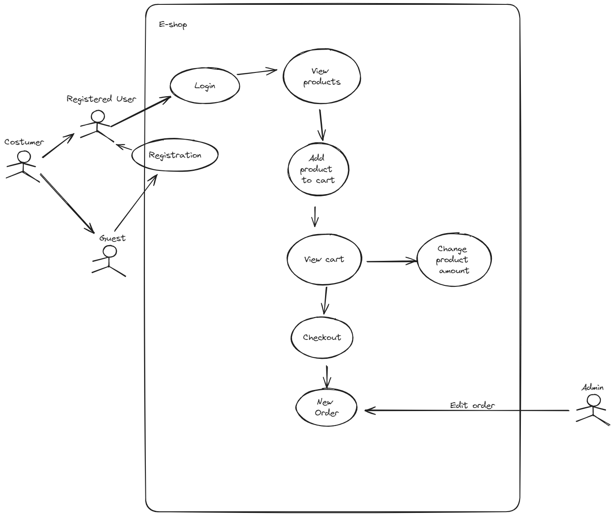
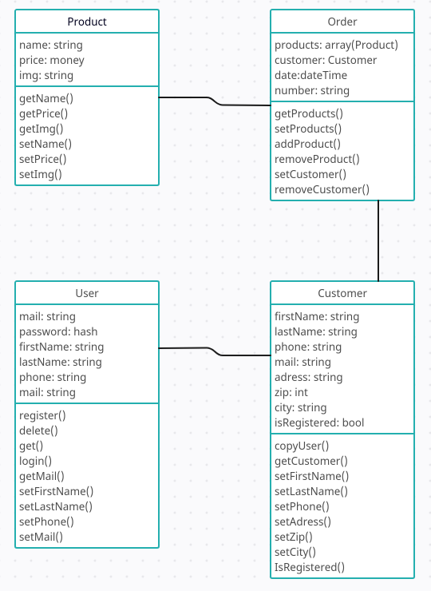
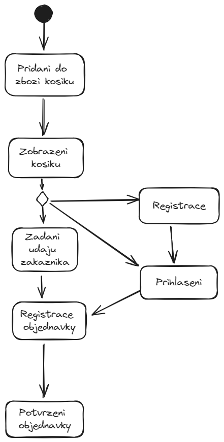
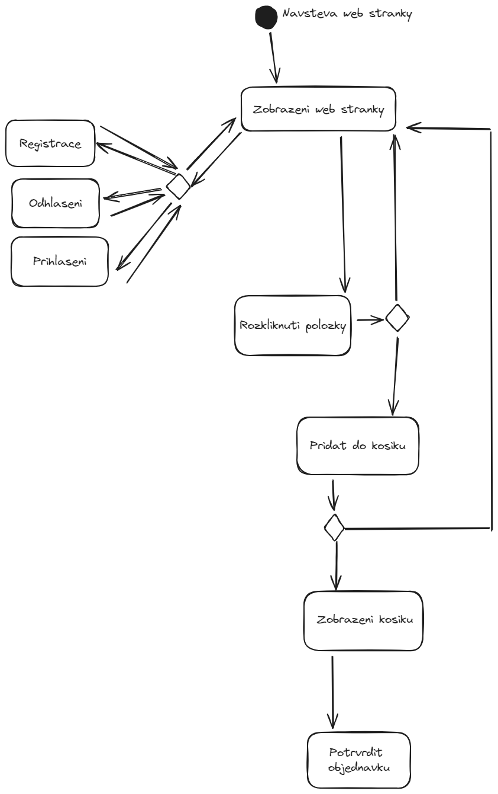

#  Librictio.com

## Description
This is a simple e-shop for books application written in Symfony 4.4. It is a part of my school project.

## Authors
- [Matyáš Závora](https://www.linkedin.com/in/matyas-zavora/)
  
- [Sofia Borodkina](www.linkedin.com/in/sofie-borodkina-900216269)
  

## Assignment
- E-shop where you can order books.
- Users will be able to order books even without logging in.
- If the user registers and logs in, his data is automatically filled in the order.
- Admin will be able to add, edit and delete books.
  -He will also be able to see all orders and delete them.

## TODO
- Login/Registration page
  - [ ] Login form
  - [ ] Registration link
    - [ ] Registration form
- Home page
  - [ ] Create a navigation bar
  - [ ] Create a product list
  - [ ] Add a search bar
- Product page
  - [ ] Image
  - [ ] Product name
  - [ ] Product description
  - [ ] Product price
  - [ ] Add to cart button
    - [ ] Amount
- Shopping cart page
  - [ ] List of products
    - [ ] Amount
    - [ ] Product name
    - [ ] Product price
    - [ ] Product image
  - [ ] Total price
  - [ ] Checkout button
  - [ ] Remove from cart button
  - [ ] Remove everything from cart button
- Contact page
  - [ ] Add contact information
- Admin panel
  - [ ] Login form
  - [ ] Add new products
    - [ ] Edit existing products (name, description, price, image, amount)
    - [ ] Remove products
    - [ ] See all orders (edit, remove, ...)

## Diagrams
### Use case diagram

### Class diagram

### Activity diagram(s)

